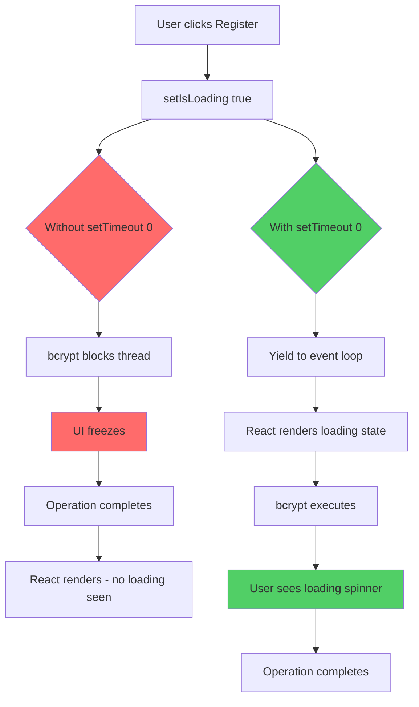
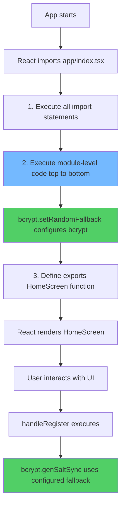
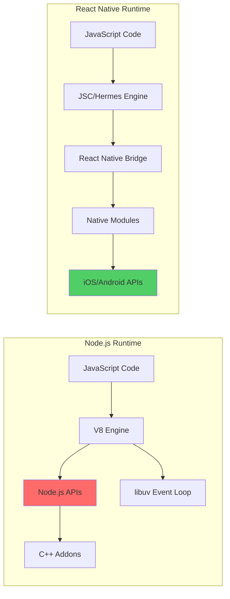
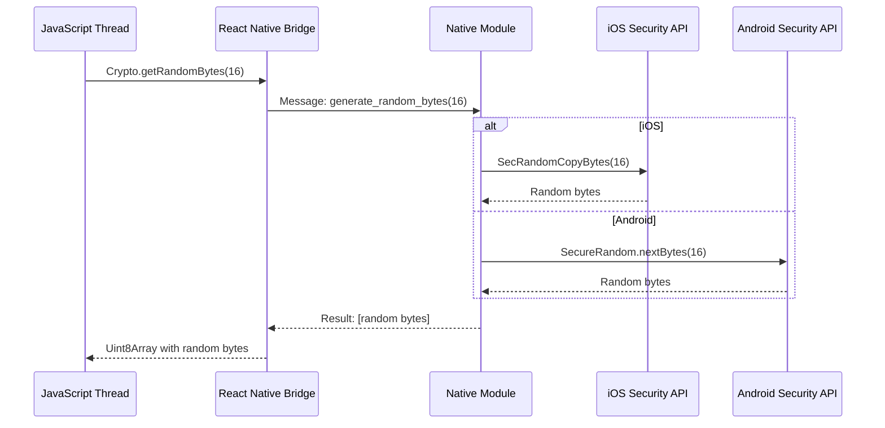
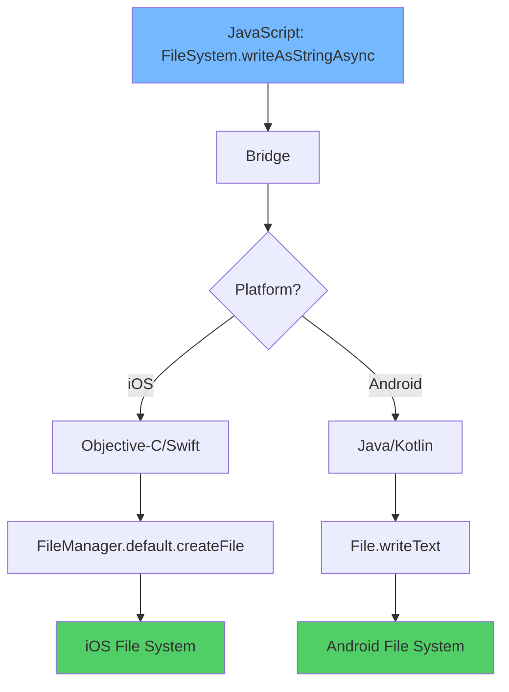
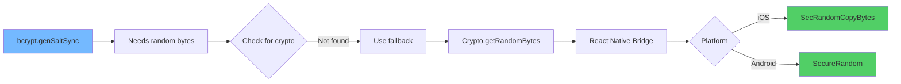
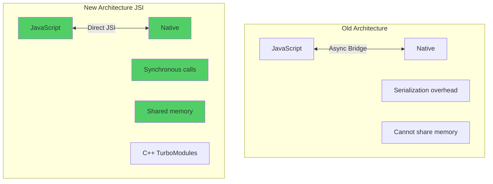

# Welcome to Descalate App 👋

This is an [Expo](https://expo.dev) project created with [`create-expo-app`](https://www.npmjs.com/package/create-expo-app).

## Get started

1. Install dependencies

   ```bash
   npm install
   ```

2. Start the app

   ```bash
   npx expo start
   ```

In the output, you'll find options to open the app in a

- [development build](https://docs.expo.dev/develop/development-builds/introduction/)
- [Android emulator](https://docs.expo.dev/workflow/android-studio-emulator/)
- [iOS simulator](https://docs.expo.dev/workflow/ios-simulator/)
- [Expo Go](https://expo.dev/go), a limited sandbox for trying out app development with Expo

You can start developing by editing the files inside the **app** directory. This project uses [file-based routing](https://docs.expo.dev/router/introduction).

## ⚠️ Important: Google OAuth Requires Development Build

**Google authentication DOES NOT work with Expo Go** due to custom URI scheme limitations. You must use a Development Build instead.

### Why Development Build is Required

Expo Go cannot handle custom URI schemes (like `descalate://`) which are required for OAuth redirects. When you try to use Google Sign-In in Expo Go, you'll get redirect URI errors because it tries to use local IP addresses (`exp://192.168.x.x:8081`) instead of the proper OAuth redirect URI.

### Running with Development Build

**Option 1: Local Development Build (Recommended)**

```bash
# For iOS (requires macOS with Xcode)
npx expo run:ios

# For Android (requires Android Studio)
npx expo run:android
```

This will:

- Build a native development version of your app
- Install it on your simulator/emulator or physical device
- Start the Metro bundler
- Enable Google OAuth with the proper `descalate://` URI scheme

**Option 2: EAS Build (Cloud Build)**

```bash
# Install EAS CLI globally
npm install -g eas-cli

# Login to your Expo account
eas login

# Create a development build for iOS
eas build --profile development --platform ios

# Or for Android
eas build --profile development --platform android
```

After the build completes, download and install it on your device, then:

```bash
# Start the development server
npx expo start --dev-client
```

### Development vs Expo Go Comparison

| Feature            | Expo Go                | Development Build         |
| ------------------ | ---------------------- | ------------------------- |
| Google OAuth       | ❌ No                  | ✅ Yes                    |
| Custom URI Schemes | ❌ Limited             | ✅ Full Support           |
| Native Modules     | ❌ Pre-configured only | ✅ Any module             |
| Build Time         | ⚡ Instant             | 🐌 5-20 minutes           |
| Best For           | Quick prototyping      | Production-ready features |

### Troubleshooting OAuth Issues

If you see errors like:

- `Error 400: invalid_request`
- `redirect_uri=exp://192.168.x.x:8081`
- `redirect_uri=exp://wlbzvrg-pablo_flores_465-8081.exp.direct`

**Solution:** You're using Expo Go. Switch to a Development Build as described above.

### Correct Redirect URIs for Google Console

When using Development Builds, ensure these redirect URIs are configured in Google Cloud Console:

**Web Client ID:**

```
https://auth.expo.io/@pablo_flores_465/descalate
```

**iOS Client ID:**

- No redirect URI needed (handled by native app)

**Android Client ID:**

- No redirect URI needed (handled by native app)

## Project Configuration

### Package Identifiers

**Android:**

```
Package Name: com.pablo.descalate
```

**iOS:**

```
Bundle Identifier: com.pablo.descalate
```

Package Name: com.anonymous.descalate

```

**iOS:**

```

Bundle Identifier: com.anonymous.descalate

````

### Google OAuth Setup

This app uses Google Sign-In for authentication. Here's how to verify and configure it:

#### 1. Verify Package Name/Bundle ID

**Check Android package name:**

```bash
npx expo config --type public | grep package
````

**Check iOS bundle identifier:**

```bash
npx expo config --type public | grep bundleIdentifier
```

Or manually check in `app.json`:

```json
{
  "expo": {
    "android": {
      "package": "com.pablo.descalate"
    },
    "ios": {
      "bundleIdentifier": "com.pablo.descalate"
    }
  }
}
```

#### 2. Google Cloud Console Setup

1. Go to [Google Cloud Console](https://console.cloud.google.com/)
2. Create or select your project
3. Navigate to **APIs & Services** > **Credentials**
4. Create OAuth 2.0 Client IDs for each platform:

**How to get required values:**

| Field                    | Where to find it                                                  | Example                 |
| ------------------------ | ----------------------------------------------------------------- | ----------------------- |
| **Android Package Name** | `app.json` → `android.package`                                    | `com.pablo.descalate`   |
| **iOS Bundle ID**        | `app.json` → `ios.bundleIdentifier`                               | `com.pablo.descalate`   |
| **iOS Team ID**          | [Apple Developer Membership](https://developer.apple.com/account) | `AB12CD34EF` (optional) |
| **iOS App Store ID**     | App Store Connect (after publishing)                              | Leave empty for now     |
| **SHA-1 Fingerprint**    | See section below                                                 | `9C:D8:C6:4F:...`       |

**Android Client:**

- Application type: `Android`
- Package name: `com.pablo.descalate`
- SHA-1 certificate fingerprint: See below

**iOS Client:**

- Application type: `iOS`
- Bundle ID: `com.pablo.descalate`
- App Store ID: _Leave empty_ (only needed after publishing)
- Team ID: _Optional_ (only if you have Apple Developer account)

**Web Client (for Expo Go):**

- Application type: `Web application`
- Authorized JavaScript origins: _Leave empty_
- Authorized redirect URIs (add these 3):
  ```
  https://auth.expo.io/@pablo_flores_465/descalate
  http://localhost:19006
  https://localhost
  ```

**Your Expo username:** `pablo_flores_465`

To verify or check in the future:

```bash
npx expo whoami
```

**Important:**

- Web Clients ONLY accept `http://` and `https://` URIs
- Custom schemes like `descalate://` are NOT valid for Web Clients
- They are only valid for Android/iOS clients in production builds
  https://auth.expo.io/@pablo_flores_465/descalate
  http://localhost:19006
  https://localhost

````

**Your Expo username:** `pablo_flores_465`

To verify or check in the future:

```bash
npx expo whoami
````

#### 3. Get SHA-1 Certificate Fingerprint

**For Development (Expo Go):**

```
SHA-1: 9C:D8:C6:4F:75:98:97:75:CE:2E:9B:D0:F7:23:1F:70:7C:3A:7E:8D
```

This is Expo's debug keystore SHA-1 - use it for initial testing.

**For Production (EAS Build):**

```bash
# Install EAS CLI
npm install -g eas-cli

# Login to Expo
eas login

# View credentials
eas credentials
```

**Alternative - Using keytool:**

```bash
keytool -list -v -keystore ~/.android/debug.keystore -alias androiddebugkey -storepass android -keypass android
```

#### 5. How to Get iOS Team ID

**If you DON'T have an Apple Developer account:**

- Leave the Team ID field **empty** - it's optional for development
- Google OAuth will still work for testing with Expo Go

**If you HAVE an Apple Developer account:**

**Method 1 - Apple Developer Portal:**

1. Go to [https://developer.apple.com/account](https://developer.apple.com/account)
2. Sign in with your Apple ID
3. Click on **Membership** in the sidebar
4. Your **Team ID** will be displayed (10 alphanumeric characters)
   - Example: `AB12CD34EF`

**Method 2 - Using Xcode (macOS only):**

1. Open Xcode
2. Go to **Xcode** → **Preferences** → **Accounts**
3. Select your Apple ID
4. Click on your team name
5. The Team ID appears next to the team name

**Method 3 - Using EAS CLI:**

```bash
# Install EAS CLI
npm install -g eas-cli

# Login and view credentials
eas credentials

# Your Team ID will be shown in the iOS credentials
```

**Note:** The Team ID is only required if you plan to:

- Build standalone iOS apps
- Publish to App Store
- Use Apple Developer features

For development with Expo Go, you can skip this field.

#### 4. Login to Expo (Required)

Before configuring the Web Client, you need to know your Expo username:

```bash
# Login to Expo
npx expo login

# Verify your username
npx expo whoami
```

Your Expo username will be used in the Web Client redirect URI:

```
https://auth.expo.io/@YOUR-USERNAME/descalate
```

#### 5. Configuration Files

**Already configured!** The following files have been created:

**`constants/google-config.ts`** - OAuth Client IDs

```typescript
export const GOOGLE_CONFIG = {
  webClientId: '435201606498-qu4j1lm3oarqrtf6gq1hal3j305s9i2q.apps.googleusercontent.com',
  iosClientId: '435201606498-7fkuennuhmg3am4h51jc711l06ijiq91.apps.googleusercontent.com',
  androidClientId: '435201606498-q0594tfv24pqluq9o90a1q956e6r8p8q.apps.googleusercontent.com',
};
```

**`hooks/useGoogleAuth.ts`** - Custom hook for Google authentication

- Handles OAuth flow
- Fetches user information
- Manages authentication state

### How to Verify Configuration

**Check all config values at once:**

```bash
npx expo config --type public
```

**View specific sections:**

```bash
# Android config
npx expo config --type public | grep -A 10 "android"

# iOS config
npx expo config --type public | grep -A 10 "ios"
```

## Google Sign-In Usage

### Basic Implementation

```typescript
import { useGoogleAuth } from '@/hooks/useGoogleAuth';

export default function LoginScreen() {
  const { promptAsync, userInfo, loading, request } = useGoogleAuth();

  const handleGoogleLogin = async () => {
    try {
      await promptAsync();
    } catch (error) {
      console.error('Google login error:', error);
    }
  };

  return (
    <View>
      <Pressable
        onPress={handleGoogleLogin}
        disabled={!request || loading}
      >
        <Text>Sign in with Google</Text>
      </Pressable>

      {userInfo && (
        <View>
          <Text>Welcome {userInfo.name}</Text>
          <Image source={{ uri: userInfo.picture }} />
        </View>
      )}
    </View>
  );
}
```

### User Info Response

After successful login, `userInfo` contains:

```typescript
{
  id: string; // Google user ID
  email: string; // User's email
  verified_email: boolean; // Email verification status
  name: string; // Full name
  given_name: string; // First name
  family_name: string; // Last name
  picture: string; // Profile picture URL
  locale: string; // User's locale (e.g., "es")
}
```

### Integration with SQLite

To save Google users to your database:

```typescript
useEffect(() => {
  if (userInfo && db) {
    const { email, name, picture, id } = userInfo;
    db.runAsync(
      'INSERT OR REPLACE INTO users (email, name, picture, google_id) VALUES (?, ?, ?, ?)',
      [email, name, picture, id]
    ).then(() => {
      console.log('✅ User saved to database');
    });
  }
}, [userInfo, db]);
```

**Update your users table schema:**

```sql
CREATE TABLE IF NOT EXISTS users (
  id INTEGER PRIMARY KEY AUTOINCREMENT,
  email TEXT UNIQUE,
  password TEXT,
  name TEXT,
  picture TEXT,
  google_id TEXT UNIQUE
);
```

**View specific sections:**

```bash
# Android config
npx expo config --type public | grep -A 10 "android"

# iOS config
npx expo config --type public | grep -A 10 "ios"
```

## Get a fresh project

When you're ready, run:

```bash
npm run reset-project
```

This command will move the starter code to the **app-example** directory and create a blank **app** directory where you can start developing.

## Learn more

To learn more about developing your project with Expo, look at the following resources:

- [Expo documentation](https://docs.expo.dev/): Learn fundamentals, or go into advanced topics with our [guides](https://docs.expo.dev/guides).
- [Learn Expo tutorial](https://docs.expo.dev/tutorial/introduction/): Follow a step-by-step tutorial where you'll create a project that runs on Android, iOS, and the web.

## Join the community

Join our community of developers creating universal apps.

- [Expo on GitHub](https://github.com/expo/expo): View our open source platform and contribute.
- [Discord community](https://chat.expo.dev): Chat with Expo users and ask questions.

---

# 🍎 Integración de Apple Login

## Paso a Paso para Implementar Sign In with Apple

### 📋 Prerequisitos

- **Cuenta de Apple Developer** ($99/año)
- **macOS** (requerido para configuración completa)
- **Xcode** instalado
- **Expo SDK 50+**

---

### 1️⃣ Configuración en Apple Developer

#### 1.1 Crear un App ID

1. Ve a [Apple Developer Portal](https://developer.apple.com/account/)
2. Ve a **Certificates, Identifiers & Profiles**
3. Selecciona **Identifiers** → Click en **+** (crear nuevo)
4. Selecciona **App IDs** → Click **Continue**
5. Selecciona **App** → Click **Continue**
6. Configura:
   - **Description:** `Descalate App`
   - **Bundle ID:** Explicit → `com.pablo.descalate` (debe coincidir con tu `app.json`)
   - **Capabilities:** Marca ✅ **Sign In with Apple**
7. Click **Continue** → **Register**

#### 1.2 Crear un Service ID (para Web)

1. En **Identifiers** → Click **+** (crear nuevo)
2. Selecciona **Services IDs** → Click **Continue**
3. Configura:
   - **Description:** `Descalate Web Service`
   - **Identifier:** `com.pablo.descalate.service` (debe ser único)
4. Click **Continue** → **Register**
5. Click en el Service ID recién creado
6. Marca ✅ **Sign In with Apple**
7. Click **Configure** junto a "Sign In with Apple"
8. Configura:
   - **Primary App ID:** Selecciona `com.pablo.descalate`
   - **Website URLs:**
     - **Domains:** `auth.expo.io`
     - **Return URLs:** `https://auth.expo.io/@pablo_flores_465/descalate`
9. Click **Save** → **Continue** → **Save**

#### 1.3 Crear una Key para Sign In with Apple

1. Ve a **Keys** → Click **+** (crear nueva)
2. Configura:
   - **Key Name:** `Descalate Apple Sign In Key`
   - Marca ✅ **Sign In with Apple**
   - Click **Configure** → Selecciona tu App ID principal
3. Click **Continue** → **Register**
4. **⚠️ IMPORTANTE:** Descarga el archivo `.p8` - **solo podrás descargarlo una vez**
5. Anota:
   - **Key ID:** (10 caracteres, ej: `AB12CD34EF`)
   - **Team ID:** (visible en la esquina superior derecha)

---

### 2️⃣ Configuración en tu Proyecto Expo

#### 2.1 Instalar Dependencias

```bash
npx expo install expo-apple-authentication
```

#### 2.2 Actualizar `app.json`

Agrega la configuración de Apple en tu `app.json`:

```json
{
  "expo": {
    "ios": {
      "bundleIdentifier": "com.pablo.descalate",
      "usesAppleSignIn": true,
      "entitlements": {
        "com.apple.developer.applesignin": ["Default"]
      }
    },
    "plugins": [["expo-apple-authentication"]]
  }
}
```

#### 2.3 Crear Hook Personalizado

Crea el archivo `hooks/useAppleAuth.ts`:

```typescript
import { useEffect, useState } from 'react';
import * as AppleAuthentication from 'expo-apple-authentication';
import { Platform } from 'react-native';

interface AppleUserInfo {
  user: string; // Unique Apple user ID
  email: string | null;
  fullName?: {
    givenName: string | null;
    familyName: string | null;
  };
  identityToken: string;
  authorizationCode: string;
}

export const useAppleAuth = () => {
  const [isAvailable, setIsAvailable] = useState(false);
  const [userInfo, setUserInfo] = useState<AppleUserInfo | null>(null);
  const [loading, setLoading] = useState(false);

  useEffect(() => {
    checkAvailability();
  }, []);

  const checkAvailability = async () => {
    if (Platform.OS === 'ios') {
      const available = await AppleAuthentication.isAvailableAsync();
      setIsAvailable(available);
    }
  };

  const signIn = async () => {
    if (!isAvailable) {
      console.warn('Apple Authentication is not available on this device');
      return null;
    }

    try {
      setLoading(true);
      const credential = await AppleAuthentication.signInAsync({
        requestedScopes: [
          AppleAuthentication.AppleAuthenticationScope.FULL_NAME,
          AppleAuthentication.AppleAuthenticationScope.EMAIL,
        ],
      });

      const user: AppleUserInfo = {
        user: credential.user,
        email: credential.email,
        fullName: credential.fullName,
        identityToken: credential.identityToken!,
        authorizationCode: credential.authorizationCode!,
      };

      setUserInfo(user);
      return user;
    } catch (error: any) {
      if (error.code === 'ERR_CANCELED') {
        console.log('User canceled Apple Sign In');
      } else {
        console.error('Apple Sign In error:', error);
      }
      return null;
    } finally {
      setLoading(false);
    }
  };

  const signOut = () => {
    setUserInfo(null);
  };

  return {
    signIn,
    signOut,
    userInfo,
    loading,
    isAvailable,
  };
};
```

---

### 3️⃣ Implementación en tu UI

#### 3.1 Ejemplo Básico

```typescript
import { useAppleAuth } from '@/hooks/useAppleAuth';
import * as AppleAuthentication from 'expo-apple-authentication';
import { View, Text, Alert } from 'react-native';

export default function LoginScreen() {
  const { signIn, userInfo, loading, isAvailable } = useAppleAuth();

  const handleAppleLogin = async () => {
    const user = await signIn();
    if (user) {
      Alert.alert('Success', `Welcome ${user.email || 'User'}!`);
      // Aquí puedes guardar en SQLite o hacer llamada a tu API
    }
  };

  if (!isAvailable) {
    return null; // No mostrar el botón si no está disponible
  }

  return (
    <View>
      <AppleAuthentication.AppleAuthenticationButton
        buttonType={AppleAuthentication.AppleAuthenticationButtonType.SIGN_IN}
        buttonStyle={AppleAuthentication.AppleAuthenticationButtonStyle.BLACK}
        cornerRadius={5}
        style={{ width: 200, height: 44 }}
        onPress={handleAppleLogin}
      />

      {userInfo && (
        <View>
          <Text>User ID: {userInfo.user}</Text>
          <Text>Email: {userInfo.email || 'Not provided'}</Text>
          <Text>
            Name: {userInfo.fullName?.givenName} {userInfo.fullName?.familyName}
          </Text>
        </View>
      )}
    </View>
  );
}
```

---

### 4️⃣ Integración con SQLite

#### 4.1 Actualizar Schema de Base de Datos

```sql
CREATE TABLE IF NOT EXISTS users (
  id INTEGER PRIMARY KEY AUTOINCREMENT,
  email TEXT UNIQUE,
  password TEXT,
  name TEXT,
  picture TEXT,
  google_id TEXT UNIQUE,
  apple_id TEXT UNIQUE,
  auth_provider TEXT DEFAULT 'email'
);
```

#### 4.2 Guardar Usuario de Apple

```typescript
import { useAppleAuth } from '@/hooks/useAppleAuth';
import { useEffect } from 'react';

export default function LoginScreen() {
  const { signIn, userInfo } = useAppleAuth();
  const db = useSQLiteContext(); // Tu contexto de base de datos

  useEffect(() => {
    if (userInfo && db) {
      const fullName = userInfo.fullName
        ? `${userInfo.fullName.givenName || ''} ${userInfo.fullName.familyName || ''}`.trim()
        : null;

      db.runAsync(
        `INSERT OR REPLACE INTO users (email, name, apple_id, auth_provider) 
         VALUES (?, ?, ?, ?)`,
        [
          userInfo.email || `${userInfo.user}@privaterelay.appleid.com`,
          fullName || 'Apple User',
          userInfo.user,
          'apple',
        ]
      ).then(() => {
        console.log('✅ Apple user saved to database');
      });
    }
  }, [userInfo, db]);

  // ... resto del código
}
```

---

### 5️⃣ Construir y Probar

#### ⚠️ IMPORTANTE: NO funciona en Expo Go

Apple Sign In **requiere un Development Build**, similar a Google OAuth.

#### Opción 1: Build Local (Requiere macOS)

```bash
# Para iOS
npx expo run:ios
```

#### Opción 2: EAS Build (Cloud)

```bash
# Instalar EAS CLI
npm install -g eas-cli

# Login
eas login

# Configurar proyecto
eas build:configure

# Build de desarrollo para iOS
eas build --profile development --platform ios
```

Después de que el build termine:

```bash
# Descargar e instalar el .ipa en tu dispositivo iOS
# Luego iniciar el servidor de desarrollo
npx expo start --dev-client
```

---

### 6️⃣ Estilos de Botón Disponibles

Apple proporciona botones estandarizados que debes usar:

```typescript
// Tipos de Botón
AppleAuthenticationButtonType.SIGN_IN; // "Sign in with Apple"
AppleAuthenticationButtonType.SIGN_UP; // "Sign up with Apple"
AppleAuthenticationButtonType.CONTINUE; // "Continue with Apple"

// Estilos
AppleAuthenticationButtonStyle.BLACK; // Fondo negro, texto blanco
AppleAuthenticationButtonStyle.WHITE; // Fondo blanco, texto negro
AppleAuthenticationButtonStyle.WHITE_OUTLINE; // Borde blanco, fondo transparente
```

---

### 7️⃣ Manejo de Casos Especiales

#### 7.1 Email Privado (Hide My Email)

Apple permite a los usuarios ocultar su email real. Recibirás un email como:

```
abc123xyz@privaterelay.appleid.com
```

**⚠️ IMPORTANTE:**

- Este email es válido y funcional
- Los correos enviados a esta dirección se reenvían al usuario
- El usuario puede desactivar el reenvío en cualquier momento
- **Debes tratarlo como un email real** en tu sistema

#### 7.2 Información del Nombre

**⚠️ CRÍTICO:** Apple solo proporciona el nombre **la primera vez** que el usuario inicia sesión.

**Estrategia recomendada:**

```typescript
const handleAppleLogin = async () => {
  const user = await signIn();

  if (user) {
    // Verificar si ya existe en la base de datos
    const existingUser = await db.getFirstAsync('SELECT * FROM users WHERE apple_id = ?', [
      user.user,
    ]);

    if (!existingUser) {
      // Primera vez - guardar nombre
      const fullName = user.fullName
        ? `${user.fullName.givenName || ''} ${user.fullName.familyName || ''}`
        : null;

      // Guardar en base de datos
      await saveToDatabase(user.email, fullName, user.user);
    } else {
      // Usuario existente - usar datos guardados
      console.log('Welcome back!', existingUser.name);
    }
  }
};
```

#### 7.3 Verificación del Estado del Usuario

```typescript
const checkCredentialState = async (userID: string) => {
  try {
    const credentialState = await AppleAuthentication.getCredentialStateAsync(userID);

    switch (credentialState) {
      case AppleAuthentication.AppleAuthenticationCredentialState.AUTHORIZED:
        console.log('User is authorized');
        break;
      case AppleAuthentication.AppleAuthenticationCredentialState.REVOKED:
        console.log('User revoked authorization');
        // Cerrar sesión del usuario
        break;
      case AppleAuthentication.AppleAuthenticationCredentialState.NOT_FOUND:
        console.log('Credential not found');
        break;
    }
  } catch (error) {
    console.error('Error checking credential state:', error);
  }
};
```

---

### 8️⃣ Troubleshooting

#### Problema: "Sign In with Apple is not available"

**Soluciones:**

1. Verifica que estás en un dispositivo iOS (no Android)
2. Verifica que el dispositivo tenga iOS 13+
3. Confirma que estás usando un Development Build (no Expo Go)
4. Verifica que `usesAppleSignIn: true` está en `app.json`

#### Problema: "Invalid client"

**Soluciones:**

1. Verifica que el Bundle ID coincide:
   - `app.json` → `ios.bundleIdentifier`
   - Apple Developer → App ID
2. Confirma que Sign In with Apple está habilitado en el App ID
3. Verifica que el Service ID está correctamente configurado

#### Problema: No recibo email o nombre

**Soluciones:**

1. **Email:** El usuario puede haber elegido "Hide My Email"
2. **Nombre:** Apple solo lo envía la primera vez
   - Elimina la app y vuelve a instalar para probarlo de nuevo
   - Ve a Ajustes → Apple ID → Contraseña y Seguridad → Apps usando Apple ID → Elimina tu app

---

### 9️⃣ Recursos Adicionales

- [Expo Apple Authentication Docs](https://docs.expo.dev/versions/latest/sdk/apple-authentication/)
- [Apple Sign In Guidelines](https://developer.apple.com/design/human-interface-guidelines/sign-in-with-apple)
- [Apple Developer Documentation](https://developer.apple.com/documentation/sign_in_with_apple)

---

### 🔒 Mejores Prácticas de Seguridad

1. **Valida el `identityToken` en tu backend** usando las claves públicas de Apple
2. **Guarda el `user` ID** (es permanente e inmutable para tu app)
3. **No dependas solo del email** - puede cambiar o ser revocado
4. **Implementa un mecanismo de actualización de email** en tu app
5. **Verifica periódicamente el estado de la credencial** para detectar revocaciones

---

### ✅ Checklist de Implementación

- [ ] Cuenta de Apple Developer activa
- [ ] App ID creado con Sign In with Apple habilitado
- [ ] Service ID creado y configurado
- [ ] Key descargada y guardada de forma segura
- [ ] `expo-apple-authentication` instalado
- [ ] `app.json` actualizado con configuración iOS
- [ ] Hook `useAppleAuth.ts` creado
- [ ] UI implementada con botones oficiales de Apple
- [ ] Schema de base de datos actualizado
- [ ] Development Build creado (no Expo Go)
- [ ] Manejo de "Hide My Email" implementado
- [ ] Guardado de nombre en primera autenticación
- [ ] Verificación de estado de credenciales implementada

---

## 🔐 Password Hashing with bcrypt in React Native

### The Challenge: Main Thread Blocking

When hashing passwords with bcrypt in React Native, you may notice that loading states don't appear or the UI freezes briefly. This is because bcrypt's synchronous operations block the JavaScript thread.

#### The Problem

```typescript
setIsLoading(true); // ← Queues state update
const salt = bcrypt.genSaltSync(10); // ← BLOCKS THREAD immediately (~100-500ms)
const hash = bcrypt.hashSync(password, salt); // ← Still blocking
// React never gets a chance to render the loading state
```

**What happens:**

1. `setIsLoading(true)` marks the state for update, but React doesn't render immediately
2. `bcrypt.genSaltSync()` is a **synchronous, CPU-intensive operation** that blocks the JavaScript thread
3. While the thread is blocked, React cannot render the new loading state
4. When bcrypt finishes, the thread unblocks and React renders, but it's already done

#### Visual Flow



### The Solution: Yielding to the Main Thread

We need to give React time to render **before** bcrypt blocks the thread. This is called "yielding to the main thread":

```typescript
const handleRegister = async (email: string, password: string) => {
  setIsLoading(true);

  // Yield to the event loop - allows React to render
  await new Promise((resolve) => setTimeout(resolve, 0));

  const hashPassword = (password: string): string => {
    const salt = bcrypt.genSaltSync(10);
    const hashedPassword = bcrypt.hashSync(password, salt);
    return hashedPassword;
  };

  try {
    // ... rest of registration logic
  } finally {
    setIsLoading(false);
  }
};
```

#### Why `setTimeout(resolve, 0)` Works

```typescript
setIsLoading(true); // 1. Mark state for update

await new Promise((resolve) => setTimeout(resolve, 0)); // 2. YIELD CONTROL

// 3. JavaScript processes the event queue
// 4. React renders the loading state
// 5. setTimeout callback executes, resuming here

const salt = bcrypt.genSaltSync(10); // 6. Now it blocks, but we already rendered
```

**The `setTimeout(..., 0)` trick:**

- **Not a real time delay** - it's about task scheduling
- **Yields to the event loop** - tells JavaScript: "pause here and process pending tasks"
- **Allows React to render** before continuing with the blocking operation
- **Returns control** after React has rendered the loading state

### Implementation in the Codebase

The registration flow in `app/index.tsx` implements this pattern:

```typescript
const handleRegister = async (email: string, password: string) => {
  setIsLoading(true);

  // Critical: yield to allow React to render loading state
  await new Promise((resolve) => setTimeout(resolve, 0));

  const hashPassword = (password: string): string => {
    const salt = bcrypt.genSaltSync(10);
    const hashedPassword = bcrypt.hashSync(password, salt);
    return hashedPassword;
  };

  try {
    setErrors({});
    // Validation and database operations...
  } finally {
    setIsLoading(false);
  }
};
```

### bcrypt Configuration for React Native

bcrypt requires a random number generator. In React Native, we use `expo-crypto` as a fallback:

```typescript
import bcrypt from 'bcryptjs';
import * as Crypto from 'expo-crypto';

// Configure bcrypt to use expo-crypto for random number generation
bcrypt.setRandomFallback((len: number) => {
  const randomBytes = Crypto.getRandomBytes(len);
  return Array.from(randomBytes);
});
```

**Why this is needed:**

- bcrypt normally uses Node.js `crypto` module for random numbers
- React Native doesn't have Node.js `crypto` module
- `expo-crypto` uses native iOS/Android secure random number generators
- This ensures cryptographically secure password hashing on mobile devices

### Alternative Solutions

If bcrypt performance is still an issue, consider:

1. **Increase the delay** to 50-100ms for smoother UX:

   ```typescript
   await new Promise((resolve) => setTimeout(resolve, 100));
   ```

2. **Use Web Workers** (complex in React Native)
3. **Use a native bcrypt library** like `react-native-bcrypt`
4. **Reduce bcrypt rounds** (not recommended - weakens security)

### Key Takeaways

- **Synchronous operations block the UI** in JavaScript
- **`setTimeout(0)` yields to the event loop** - it's not about time, it's about task scheduling
- **Always yield before CPU-intensive operations** when you need UI feedback
- **This pattern applies to any blocking operation**, not just bcrypt

This is a common pattern in web/mobile development when working with blocking operations. The key is understanding the JavaScript event loop and how to work with it, not against it.

---

## 📚 Understanding Module-Level Code Execution

### Why bcrypt.setRandomFallback Runs "Before Everything"

When you see code like this at the top of a file:

```typescript
import bcrypt from 'bcryptjs';
import * as Crypto from 'expo-crypto';

// This runs BEFORE the component is defined
bcrypt.setRandomFallback((len: number) => {
  const randomBytes = Crypto.getRandomBytes(len);
  return Array.from(randomBytes);
});

export default function HomeScreen() {
  // This runs LATER when React renders the component
}
```

**It's not arbitrary** - it's about **module initialization order** in JavaScript.

### Execution Order in JavaScript Modules



### Code Execution Levels

```typescript
// LEVEL 1: Imports - Execute first
import bcrypt from 'bcryptjs';
import * as Crypto from 'expo-crypto';

// LEVEL 2: Module-level code - Execute second (ONCE per module load)
bcrypt.setRandomFallback((len: number) => {
  const randomBytes = Crypto.getRandomBytes(len);
  return Array.from(randomBytes);
});

// LEVEL 3: Component definition - Execute third (defines, not runs)
export default function HomeScreen() {
  // LEVEL 4: Component code - Executes on EVERY render
  const [count, setCount] = useState(0);

  // LEVEL 5: Effect code - Executes after render
  useEffect(() => {
    console.log('Component mounted');
  }, []);

  // LEVEL 6: Event handlers - Execute on user interaction
  const handleClick = () => {
    setCount(count + 1);
  };
}
```

### ✅ What SHOULD Be at Module Level

#### 1. Library Configuration (One-time setup)

```typescript
// ✅ GOOD: Runs once when module loads
import bcrypt from 'bcryptjs';
import * as Crypto from 'expo-crypto';

bcrypt.setRandomFallback((len: number) => {
  const randomBytes = Crypto.getRandomBytes(len);
  return Array.from(randomBytes);
});
```

**Why:** Configuration should happen once, before the library is used.

#### 2. Database Connection (Singleton pattern)

```typescript
// database/db.ts
// ✅ GOOD: Single connection, reused everywhere
import { drizzle } from 'drizzle-orm/expo-sqlite';
import { openDatabaseSync } from 'expo-sqlite';
import * as schema from './schema';

export const expoDb = openDatabaseSync('descalate.db');
export const db = drizzle(expoDb, { schema });
```

**Why:** Database connections should be created once and reused.

#### 3. Constants and Configuration

```typescript
// constants/config.ts
// ✅ GOOD: Never change, don't depend on state
export const API_URL = 'https://api.example.com';
export const MAX_RETRIES = 3;
export const SALT_ROUNDS = 10;
export const TIMEOUT_MS = 5000;
```

**Why:** Constants are immutable and globally accessible.

#### 4. Pure Utility Functions

```typescript
// utils/format.ts
// ✅ GOOD: Pure functions, no side effects
export const formatCurrency = (amount: number) => {
  return new Intl.NumberFormat('es-MX', {
    style: 'currency',
    currency: 'MXN',
  }).format(amount);
};

export const capitalize = (str: string) => {
  return str.charAt(0).toUpperCase() + str.slice(1);
};
```

**Why:** Pure functions don't depend on component state or lifecycle.

### ❌ What Should NOT Be at Module Level

#### 1. React State

```typescript
// ❌ BAD: useState must be inside a component
const [count, setCount] = useState(0);

export default function Component() {
  // ✅ GOOD: useState inside component
  const [count, setCount] = useState(0);
}
```

**Why:** React hooks require the component lifecycle.

#### 2. React Effects

```typescript
// ❌ BAD: useEffect needs component lifecycle
useEffect(() => {
  fetchData();
}, []);

export default function Component() {
  // ✅ GOOD: useEffect inside component
  useEffect(() => {
    fetchData();
  }, []);
}
```

**Why:** Effects are tied to component mount/unmount.

#### 3. Operations That Can Fail (like migrations)

```typescript
// ❌ BAD: No error handling at module level
await runMigrations(db); // What if this fails?

export default function Component() {
  // ✅ GOOD: Error handling in useEffect
  useEffect(() => {
    async function setup() {
      try {
        await runMigrations(db);
      } catch (error) {
        console.error('Migration failed:', error);
        Alert.alert('Database Error', 'Please restart the app');
      }
    }
    setup();
  }, []);
}
```

**Why:** Module-level code can't easily handle errors or show UI feedback.

### Real-World Example: Database Setup

#### ❌ Before (Opening database twice)

```typescript
// database/db.ts
const expoDb = openDatabaseSync('descalate.db'); // 1st time
export const db = drizzle(expoDb, { schema });

// app/index.tsx
useEffect(() => {
  const expoDb = openDatabaseSync('descalate.db'); // 2nd time ❌ DUPLICATE
  await runMigrations(expoDb);
}, []);
```

**Problem:** Creating two separate database connections unnecessarily.

#### ✅ After (Single connection, reused)

```typescript
// database/db.ts
// ✅ Module level: Create connection once
export const expoDb = openDatabaseSync('descalate.db');
export const db = drizzle(expoDb, { schema });

// app/index.tsx
import { db, expoDb } from '@/database/db';

// ✅ Component level: Operations that can fail
useEffect(() => {
  async function setup() {
    try {
      await runMigrations(expoDb); // Reuse the connection
    } catch (error) {
      console.error('Migration failed:', error);
    }
  }
  setup();
}, []);
```

**Solution:** Connection created once at module level, migrations run in component with error handling.

### Decision Matrix: Module Level vs Component Level

| Type                          | Module Level | Component Level | Reason                         |
| ----------------------------- | ------------ | --------------- | ------------------------------ |
| **Library configuration**     | ✅ YES       | ❌ NO           | Runs once, doesn't change      |
| **Database connection**       | ✅ YES       | ❌ NO           | Singleton pattern, reusable    |
| **Constants**                 | ✅ YES       | ❌ NO           | Immutable, no side effects     |
| **Pure functions**            | ✅ YES       | ✅ YES          | Stateless, can be anywhere     |
| **Database migrations**       | ❌ NO        | ✅ YES          | Can fail, needs error handling |
| **API calls**                 | ❌ NO        | ✅ YES          | Can fail, needs loading states |
| **React state (useState)**    | ❌ NO        | ✅ YES          | Requires component lifecycle   |
| **React effects (useEffect)** | ❌ NO        | ✅ YES          | Requires component lifecycle   |
| **Custom hooks**              | ❌ NO        | ✅ YES          | Must follow Rules of Hooks     |

### Key Principle

**Module-level code runs ONCE when the module is first imported.**

```typescript
// This runs ONCE when any file imports this module
console.log('Module loaded!');
let importCount = 0;
importCount++; // Will always be 1

export default function Component() {
  // This runs EVERY TIME React renders the component
  console.log('Component rendered!');
}
```

If you import the same module from 10 different files, the module-level code still only runs **once** - the first time it's imported.

### Why bcrypt.setRandomFallback Must Be at Module Level

```typescript
// ✅ CORRECT: At module level
bcrypt.setRandomFallback((len: number) => {
  return Array.from(Crypto.getRandomBytes(len));
});

export default function Component() {
  const handleRegister = () => {
    const salt = bcrypt.genSaltSync(10); // Uses fallback configured above
  };
}
```

```typescript
// ❌ WRONG: Inside component
export default function Component() {
  bcrypt.setRandomFallback((len: number) => {
    return Array.from(Crypto.getRandomBytes(len));
  });

  const handleRegister = () => {
    const salt = bcrypt.genSaltSync(10);
  };
}

// Problems:
// 1. Runs on EVERY render (wasteful)
// 2. If bcrypt is used before first render, fallback isn't set yet
// 3. May cause race conditions
```

### Analogy: Restaurant Setup

Think of module-level code like setting up a restaurant:

```typescript
// Module level = Opening the restaurant (once)
import equipment from 'kitchen-equipment';
equipment.setupOven(); // Do this ONCE when opening
const restaurant = new Restaurant();

// Component level = Serving customers (many times)
export default function ServeCustomer() {
  useEffect(() => {
    // Do this for EACH customer
    takeOrder();
    cookFood();
    serveFood();
  }, []);
}
```

You don't want to set up the oven for every customer - you set it up once when the restaurant opens (module level), then use it for all customers (component level).

---

## 🚀 How React Native Executes JavaScript (Without Node.js)

### The JavaScript Runtime in React Native

React Native **does not use Node.js** to execute JavaScript. Instead, it uses different JavaScript engines depending on the platform:

```mermaid
graph TB
    subgraph "Your Code"
        A[JavaScript/TypeScript]
    end

    subgraph "Metro Bundler"
        B[Babel Transpiler]
        C[Bundle.js]
    end

    subgraph "iOS Device"
        D[JavaScriptCore JSC]
        E[React Native Bridge]
        F[Objective-C/Swift Native APIs]
    end

    subgraph "Android Device"
        G[Hermes Engine]
        H[React Native Bridge]
        I[Java/Kotlin Native APIs]
    end

    A --> B
    B --> C
    C --> D
    C --> G
    D --> E
    G --> H
    E --> F
    H --> I

    style D fill:#74b9ff
    style G fill:#a29bfe
    style E fill:#fdcb6e
    style H fill=#fdcb6e
```

### JavaScript Engines by Platform

| Platform    | Default Engine       | Alternative            | Notes                                                        |
| ----------- | -------------------- | ---------------------- | ------------------------------------------------------------ |
| **iOS**     | JavaScriptCore (JSC) | -                      | Same engine as Safari, built into iOS                        |
| **Android** | Hermes               | JavaScriptCore         | Hermes is optimized for React Native (default since RN 0.70) |
| **Web**     | V8 (Chrome/Edge)     | SpiderMonkey (Firefox) | When using React Native Web                                  |

### What is JavaScriptCore (JSC)?

**JavaScriptCore** is the JavaScript engine that powers WebKit and Safari.

```typescript
// Your code
const greeting = 'Hello World';
console.log(greeting);

// JSC compiles and executes this on iOS
// No Node.js APIs available!
```

**Characteristics:**

- ✅ Built into iOS (no installation needed)
- ✅ Fast and optimized for Apple devices
- ❌ No Node.js APIs (`fs`, `http`, `crypto`, etc.)
- ✅ Has standard JavaScript features (ES6+, Promises, async/await)

### What is Hermes?

**Hermes** is a JavaScript engine optimized specifically for React Native by Meta (Facebook).

```typescript
// Your code (same as above)
const greeting = 'Hello World';
console.log(greeting);

// Hermes executes this on Android with optimizations:
// - Ahead-of-time (AOT) compilation
// - Smaller app size
// - Faster startup time
```

**Why Hermes?**

- ✅ **Faster startup:** Precompiled bytecode
- ✅ **Less memory:** Optimized garbage collection
- ✅ **Smaller apps:** Better code optimization
- ✅ **Better performance:** Designed for mobile constraints

**Enable Hermes in `app.json`:**

```json
{
  "expo": {
    "android": {
      "jsEngine": "hermes"
    },
    "ios": {
      "jsEngine": "hermes"
    }
  }
}
```

### Node.js vs React Native: Runtime Comparison



| Feature               | Node.js                               | React Native                                   |
| --------------------- | ------------------------------------- | ---------------------------------------------- |
| **JavaScript Engine** | V8 (Chrome)                           | JSC (iOS), Hermes (Android)                    |
| **System APIs**       | Node.js APIs (`fs`, `http`, `crypto`) | Native Mobile APIs (Camera, GPS, Sensors)      |
| **File System**       | `fs` module                           | `expo-file-system` (bridges to native)         |
| **HTTP Requests**     | `http`/`https` modules                | `fetch` API or `axios`                         |
| **Cryptography**      | `crypto` module                       | `expo-crypto` (bridges to native)              |
| **Event Loop**        | libuv (C++ library)                   | Native OS event loop                           |
| **Native Extensions** | C++ Addons (N-API)                    | Objective-C/Swift (iOS), Java/Kotlin (Android) |
| **Environment**       | Server/Desktop                        | Mobile (iOS/Android)                           |
| **Package Manager**   | npm/yarn (all packages)               | npm/yarn (JS-only or RN-compatible)            |

### Why Node.js Modules Don't Work in React Native

```typescript
// ❌ This FAILS in React Native
import crypto from 'crypto';
crypto.randomBytes(16);
// Error: Module not found - 'crypto' doesn't exist

// ✅ This WORKS in React Native
import * as Crypto from 'expo-crypto';
Crypto.getRandomBytes(16);
// Uses native iOS/Android crypto APIs
```

**The Problem:**

- Node.js `crypto` module is a **C++ addon** that depends on OpenSSL
- React Native doesn't have Node.js runtime or C++ addon system
- Mobile devices have their **own native crypto APIs**

**The Solution:**

- `expo-crypto` is a **React Native module** that bridges to native APIs
- On iOS: Uses `Security.framework`
- On Android: Uses `java.security.SecureRandom`

### How expo-crypto Works Internally



### The React Native Bridge

**How JavaScript communicates with native code:**

```typescript
// Your JavaScript code
import { Camera } from 'expo-camera';

const takePicture = async () => {
  const photo = await camera.takePictureAsync();
  console.log(photo.uri);
};
```

**What happens internally:**

1. **JavaScript Thread:** Calls `camera.takePictureAsync()`
2. **Bridge:** Serializes the call into a message
3. **Native Thread:** Receives message, activates camera hardware
4. **Native Camera API:** Takes picture, saves to file
5. **Bridge:** Serializes result (file URI) back to JavaScript
6. **JavaScript Thread:** Receives photo.uri


### Common Module Replacements

When migrating from Node.js to React Native, use these replacements:

| Node.js Module | React Native Alternative             | Native APIs Used                                  |
| -------------- | ------------------------------------ | ------------------------------------------------- |
| `crypto`       | `expo-crypto`                        | iOS: Security.framework<br>Android: java.security |
| `fs`           | `expo-file-system`                   | iOS: FileManager<br>Android: File API             |
| `path`         | `expo-file-system.documentDirectory` | Platform-specific paths                           |
| `http`/`https` | `fetch` or `axios`                   | iOS: URLSession<br>Android: OkHttp                |
| `buffer`       | `buffer` package (polyfill)          | JavaScript implementation                         |
| `process.env`  | `expo-constants.manifest`            | Build-time constants                              |
| `os`           | `expo-device`                        | iOS: UIDevice<br>Android: Build class             |

### Example: File Operations

```typescript
// ❌ Node.js (doesn't work in RN)
import fs from 'fs';
fs.writeFileSync('/path/to/file.txt', 'Hello');

// ✅ React Native
import * as FileSystem from 'expo-file-system';

await FileSystem.writeAsStringAsync(FileSystem.documentDirectory + 'file.txt', 'Hello');
```

**What happens internally:**



### Why bcrypt Needs a Fallback

```typescript
// bcrypt internally tries:
// 1. WebCryptoAPI (not available in RN)
// 2. require('crypto') (not available in RN)
// 3. setRandomFallback (our custom solution)

import bcrypt from 'bcryptjs';
import * as Crypto from 'expo-crypto';

// Configure bcrypt to use native mobile crypto
bcrypt.setRandomFallback((len: number) => {
  const randomBytes = Crypto.getRandomBytes(len);
  return Array.from(randomBytes);
});

// Now bcrypt can generate salts using native APIs
const salt = bcrypt.genSaltSync(10);
```

**The chain of calls:**



### New Architecture: JSI (JavaScript Interface)

React Native is evolving to a new architecture that removes the bridge bottleneck:



**Benefits of JSI:**

- ✅ **Synchronous native calls** - No more async bridge
- ✅ **Shared memory** - Direct access to native objects
- ✅ **Type safety** - Better TypeScript support
- ✅ **Better performance** - No serialization overhead

### Key Takeaways

1. **React Native uses JSC (iOS) or Hermes (Android)** - NOT Node.js
2. **No Node.js APIs available** - Use Expo/React Native alternatives
3. **Native modules bridge JavaScript to platform APIs** - Camera, GPS, Crypto, etc.
4. **The bridge serializes messages** - Between JavaScript and native threads
5. **Always check module compatibility** - Not all npm packages work in React Native
6. **Use platform-specific modules** - `expo-*` packages are designed for mobile

### Quick Reference: Can I Use This Package?

```typescript
// ✅ Works in React Native
import { useState } from 'react'; // React hooks
import axios from 'axios'; // Pure JavaScript
import * as Crypto from 'expo-crypto'; // React Native module
import bcrypt from 'bcryptjs'; // Pure JavaScript (with fallback)

// ❌ Doesn't work in React Native
import crypto from 'crypto'; // Node.js module
import fs from 'fs'; // Node.js module
import express from 'express'; // Server framework
import puppeteer from 'puppeteer'; // Browser automation
```

**Rule of thumb:** If a package depends on Node.js APIs or native Node.js modules, it won't work in React Native without modifications or alternatives.

---

## 📖 Resources: Learning More About React Native Architecture

### Official Documentation

#### React Native Core Documentation

1. **[React Native Architecture Overview](https://reactnative.dev/architecture/overview)**
   - Official overview of how React Native works internally
   - Covers both old and new architecture
   - Recommended starting point

2. **[Fabric Renderer](https://reactnative.dev/architecture/fabric-renderer)**
   - Deep dive into the new rendering system
   - Explains motivations and benefits
   - Compares old vs new architecture

3. **[Render Pipeline](https://reactnative.dev/architecture/render-pipeline)**
   - Detailed explanation of render, commit, and mount phases
   - Threading model
   - Shadow tree concepts

4. **[JSI (JavaScript Interface)](https://reactnative.dev/architecture/glossary#javascript-interfaces-jsi)**
   - How JavaScript communicates with native code
   - Replaces the old Bridge
   - Direct function calls and shared memory

#### New Architecture Working Group

5. **[React Native New Architecture GitHub](https://github.com/reactwg/react-native-new-architecture)**
   - Official working group repository
   - Migration guides
   - Community discussions
   - Latest updates and announcements

### Blog Posts & Articles

#### Understanding the Bridge

6. **[Inside React Native's New Architecture (2022)](https://medium.com/coox-tech/deep-dive-into-react-natives-new-architecture-fb67ae615ccd)**
   - Explains Bridge vs JSI
   - Performance comparisons
   - Real-world examples

7. **[The React Native Bridge: A Deep Dive](https://hackernoon.com/understanding-react-native-bridge-concept-e9526066ddb8)**
   - Classic article on how the Bridge works
   - Message serialization explained
   - Threading model

8. **[React Native Under the Hood](https://www.youtube.com/watch?v=8N4f4h6SThc)** (Video)
   - Conference talk by React Native core team
   - Visual explanation of architecture
   - Demo of Bridge communication

#### JSI and New Architecture

9. **[JSI: The JavaScript Interface](https://blog.notesnook.com/getting-started-react-native-jsi/)**
   - Practical guide to JSI
   - Code examples
   - How to build JSI modules

10. **[Migrating to the New Architecture](https://reactnative.dev/docs/new-architecture-intro)**
    - Official migration guide
    - Step-by-step instructions
    - Common pitfalls

### JavaScript Engines

#### Hermes

11. **[Hermes JavaScript Engine](https://hermesengine.dev/)**
    - Official Hermes documentation
    - Performance benchmarks
    - How it differs from JSC

12. **[Why Hermes for React Native](https://engineering.fb.com/2019/07/12/android/hermes/)**
    - Meta Engineering blog post
    - Explains design decisions
    - Performance improvements

13. **[Hermes Bytecode Explained](https://hermesengine.dev/docs/bytecode/)**
    - How Hermes compiles JavaScript
    - Ahead-of-time compilation
    - App size reduction

#### JavaScriptCore (JSC)

14. **[JavaScriptCore on iOS](https://developer.apple.com/documentation/javascriptcore)**
    - Apple's official JSC documentation
    - How Safari uses JSC
    - API reference

15. **[JSC vs V8 vs Hermes Comparison](https://blog.logrocket.com/comparing-react-native-javascript-engines/)**
    - Performance benchmarks
    - Memory usage
    - Startup times

### Creating Native Modules

16. **[Native Modules Documentation](https://reactnative.dev/docs/native-modules-intro)**
    - Official guide to creating native modules
    - iOS and Android examples
    - Bridge communication

17. **[TurboModules](https://reactnative.dev/docs/the-new-architecture/pillars-turbomodules)**
    - New way to write native modules
    - Uses JSI instead of Bridge
    - Better performance

18. **[Fabric Components](https://reactnative.dev/docs/the-new-architecture/pillars-fabric-components)**
    - Creating custom native UI components
    - New architecture approach
    - Type-safe props

### Community Resources

#### YouTube Channels

19. **[React Native EU](https://www.youtube.com/@ReactNativeEU)**
    - Conference talks
    - Architecture deep dives
    - Community best practices

20. **[William Candillon](https://www.youtube.com/@wcandillon)**
    - Advanced React Native tutorials
    - Performance optimization
    - Animation techniques

#### GitHub Repositories

21. **[React Native Community](https://github.com/react-native-community)**
    - Community-maintained packages
    - Best practices
    - Migration guides

22. **[Awesome React Native](https://github.com/jondot/awesome-react-native)**
    - Curated list of resources
    - Libraries and tools
    - Learning materials

### Books

23. **[React Native in Action](https://www.manning.com/books/react-native-in-action)** by Nader Dabit
    - Comprehensive guide
    - Architecture patterns
    - Production best practices

24. **[Fullstack React Native](https://www.newline.co/fullstack-react-native/)**
    - Modern React Native development
    - New architecture coverage
    - Real-world projects

### Debugging & Performance

25. **[React DevTools](https://reactnative.dev/docs/react-devtools)**
    - Profiling React components
    - Component hierarchy
    - Performance monitoring

26. **[Flipper](https://fbflipper.com/)**
    - Mobile app debugger
    - Network inspector
    - Native logs

27. **[React Native Performance](https://reactnative.dev/docs/performance)**
    - Official performance guide
    - Common issues
    - Optimization techniques

### Specific Topics

#### Understanding the Event Loop

28. **[JavaScript Event Loop Explained](https://www.youtube.com/watch?v=8aGhZQkoFbQ)** (Video)
    - Philip Roberts' classic talk
    - Visual explanation
    - How async works

29. **[setTimeout(0) Deep Dive](https://javascript.info/settimeout-setinterval)**
    - Why it yields to event loop
    - Scheduling tasks
    - Microtasks vs macrotasks

#### Module-Level Code

30. **[ES Modules Deep Dive](https://hacks.mozilla.org/2018/03/es-modules-a-cartoon-deep-dive/)**
    - How modules are loaded
    - Execution order
    - Import/export mechanics

31. **[JavaScript Module Systems](https://dev.to/iggredible/what-the-heck-are-cjs-amd-umd-and-esm-ikm)**
    - CommonJS vs ES Modules
    - How React Native uses modules
    - Module caching

### Stack Overflow Tags

32. **[React Native on Stack Overflow](https://stackoverflow.com/questions/tagged/react-native)**
    - Community Q&A
    - Common issues
    - Expert answers

33. **[React Native Bridge Tag](https://stackoverflow.com/questions/tagged/react-native-bridge)**
    - Bridge-specific questions
    - Native module issues
    - Communication patterns

### Discord & Communities

34. **[Reactiflux Discord](https://discord.gg/reactiflux)**
    - Active React Native community
    - Real-time help
    - #react-native channel

35. **[React Native Community Discord](https://discord.com/invite/react-native-community)**
    - Official community server
    - Migration support
    - Architecture discussions

### Podcasts

36. **[React Native Radio](https://reactnativeradio.com/)**
    - Weekly podcast
    - Interviews with core team
    - Latest updates

37. **[The React Native Show](https://www.callstack.com/podcast-react-native-show)**
    - Deep technical discussions
    - Guest experts
    - Architecture topics

### Newsletter

38. **[React Native Newsletter](https://reactnativenewsletter.com/)**
    - Weekly updates
    - New libraries
    - Articles and tutorials

### Recommended Reading Order for Beginners

If you're new to React Native architecture, follow this path:

1. Start with **React Native Architecture Overview** (#1)
2. Watch **React Native Under the Hood** (#8) for visual understanding
3. Read **The React Native Bridge: A Deep Dive** (#7)
4. Explore **Fabric Renderer** (#2) to understand the new architecture
5. Learn about **Hermes** (#11) and why it matters
6. Practice with **Native Modules Documentation** (#16)
7. Join **Reactiflux Discord** (#34) for community support

### Advanced Topics

For experienced developers wanting to go deeper:

1. **JSI: The JavaScript Interface** (#9)
2. **TurboModules** (#17)
3. **Fabric Components** (#18)
4. **Hermes Bytecode** (#13)
5. **React Native New Architecture GitHub** (#5)

### Quick Reference Cards

```typescript
// Quick comparison: What to use instead of Node.js modules

// File System
Node.js:     import fs from 'fs';
React Native: import * as FileSystem from 'expo-file-system';

// Crypto
Node.js:     import crypto from 'crypto';
React Native: import * as Crypto from 'expo-crypto';

// HTTP
Node.js:     import http from 'http';
React Native: fetch() or axios

// Path
Node.js:     import path from 'path';
React Native: FileSystem.documentDirectory + 'filename'

// Process
Node.js:     process.env.NODE_ENV
React Native: __DEV__ or Constants.manifest

// Buffer
Node.js:     Buffer.from('hello')
React Native: import { Buffer } from 'buffer' (polyfill)
```

### Stay Updated

- **[React Native Blog](https://reactnative.dev/blog)** - Official announcements
- **[React Native Releases](https://github.com/facebook/react-native/releases)** - Version updates
- **[What's New in React Native](https://github.com/reactwg/react-native-releases)** - Release notes working group

### Contributing Back

Once you understand the architecture:

- **[Contributing Guide](https://reactnative.dev/contributing/overview)** - How to contribute
- **[Good First Issues](https://github.com/facebook/react-native/labels/good%20first%20issue)** - Start here
- **[Architecture Discussions](https://github.com/react-native-community/discussions-and-proposals)** - RFCs and proposals

---
